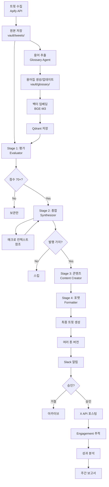

# MarketPulse - 프로젝트 스펙 문서

> AI 기반 투자 정보 자동화 및 큐레이션 플랫폼
> 최종 업데이트: 2026-01-14

---

## 📋 목차

1. [프로젝트 개요](#프로젝트-개요)
2. [핵심 기능](#핵심-기능)
3. [시스템 아키텍처](#시스템-아키텍처)
4. [데이터 구조](#데이터-구조)
5. [AI 파이프라인](#ai-파이프라인)
6. [버킷 시스템](#버킷-시스템)
7. [용어집 시스템](#용어집-시스템)
8. [워크플로우](#워크플로우)
9. [웹 구조](#웹-구조)
10. [기술 스택](#기술-스택)
11. [개발 환경](#개발-환경)
12. [모바일 & PWA](#모바일--pwa)
13. [비용 추정](#비용-추정)
14. [개발 로드맵](#개발-로드맵)

---

## 프로젝트 개요

### 목적
X(Twitter)에서 특정 투자 관련 계정들을 모니터링하고, AI가 인사이트를 추출하여 자동으로 요약 콘텐츠를 생성하는 시스템.

### 핵심 가치
- **자동화**: 수동 모니터링 불필요
- **맥락 이해**: RAG 기반으로 지식 축적 및 활용
- **품질 관리**: 승인 워크플로우로 신뢰도 확보
- **지식 그래프**: 옵시디언 스타일 용어집으로 탐색 가능

### 최종 결과물
- 승인된 요약을 X, 스레드 등 SNS에 자동 포스팅
- 옵시디언 스타일 지식베이스 웹사이트 운영
- 주간 성과 분석 보고서

---

## 핵심 기능

### 1. 버킷 관리 (투자 카테고리)
- 무제한 버킷 생성
- 각 버킷별 분석 페르소나 설정
- 버킷별 수집 주기 설정 (5분 ~ 2시간)
- 버킷간 계정 중복 허용 (레퍼런스 공유)
- 매크로 버킷 (시스템 버킷, 항상 참조)

### 2. 계정 & 키워드 모니터링
- X 계정 추가/관리 (버킷별 할당)
- 키워드 모니터링 (긴급 이벤트 감지)
- 계정 프로필 자동 수집
- 비공개 계정 자동 감지 및 제외
- 우선순위 설정 (High/Medium/Low)

### 3. 트윗 수집
- Apify API 사용 (비용 절감)
- 글로벌 수집 큐 (최소 주기 우선)
- 중복 수집 방지
- 스레드 전체 저장 + 좋아요 Top 표시
- 원본 트윗 마크다운 저장 (vault/)

### 4. AI 분석 (4단계 파이프라인)

#### Stage 1: 개별 트윗 평가 (Scoring)
- 버킷 페르소나로 평가
- RAG로 맥락 제공 (용어집, 최근 트윗)
- 5가지 점수: Relevance, Importance, Urgency, Novelty, Credibility
- 매크로 버킷 컨텍스트 항상 참조

#### Stage 2: 종합 분석 (Synthesis)
- 고득점 트윗들(70+) 재분석
- 공통 내러티브 파악
- 타임라인 구성
- 투자 액션 포인트 도출

#### Stage 3: 콘텐츠 생성 (Content Creation)
- 헤드라인, 요약, 핵심 포인트 생성
- 근거 데이터 포함
- 관련 용어 링크

#### Stage 4: 포맷 결정 (Formatting)
- 단일 트윗 / 스레드 / 긴 포스트 자동 선택
- 톤 적용 (A/B 테스트 지원)
- 최종 트윗 생성 (280자 제한)

### 5. 용어집 자동 생성
- 별도 LLM 에이전트 (Glossary Agent)
- 초보 투자자 기준 어려운 용어 필터링
- 자동 생성 후 draft 상태
- Depth 2 재귀적 확장
- 한영 자동 매칭 (aliases)
- 벡터 임베딩 (Qdrant)
- 임계값 기반 업데이트 (10회 멘션마다)

### 6. 승인 워크플로우
- Slack 알림 (중요도별 필터링)
- 웹 대시보드에서 미리보기
- 여러 톤 버전 비교
- 승인/거절/수정
- 48시간 자동 만료

### 7. 포스팅
- 승인 즉시 또는 예약 발행
- 최적 시간 추천 (과거 데이터 기반)
- 하루 최대 10개 제한
- 텍스트만 (초기)
- X API Free tier 사용 (쓰기)

### 8. 성과 추적
- 톤별 engagement 분석
- 시간대별 성과
- 타겟 계정 벤치마킹
- 주간 보고서 자동 생성 (LLM)

### 9. Public 웹사이트
- 발행된 요약 아카이브
- 옵시디언 스타일 용어집 (Wiki)
- 그래프 시각화 (React Flow)
- SEO 최적화
- RSS 피드 제공

### 10. Admin 대시보드
- 버킷/계정 관리
- 승인 대기 목록
- AI 파이프라인 흐름도 (Mermaid)
- 프롬프트 엔지니어링 에디터
- 톤 A/B 테스트 관리
- 분석 & 보고서

---

## 시스템 아키텍처

```
┌─────────────────────────────────────────────────────┐
│              Synology NAS (Docker)                  │
│                                                     │
│  ┌───────────────────────────────────────────────┐ │
│  │ Next.js Application                           │ │
│  │  - (public)/ : 퍼블릭 웹                       │ │
│  │  - (admin)/  : 어드민 대시보드                 │ │
│  │  - api/      : API routes                     │ │
│  └───────────────────────────────────────────────┘ │
│                                                     │
│  ┌───────────────────────────────────────────────┐ │
│  │ PostgreSQL                                    │ │
│  │  - 메타데이터, 트윗 인덱스                     │ │
│  └───────────────────────────────────────────────┘ │
│                                                     │
│  ┌───────────────────────────────────────────────┐ │
│  │ Qdrant (Vector DB)                            │ │
│  │  - 용어집 임베딩                               │ │
│  │  - 트윗 임베딩 (RAG용)                         │ │
│  └───────────────────────────────────────────────┘ │
│                                                     │
│  ┌───────────────────────────────────────────────┐ │
│  │ Embedding Worker (Python)                     │ │
│  │  - BGE-M3 모델 (오픈소스)                      │ │
│  │  - 로컬 실행 (비용 $0)                         │ │
│  └───────────────────────────────────────────────┘ │
│                                                     │
│  ┌───────────────────────────────────────────────┐ │
│  │ Background Worker (Node.js)                   │ │
│  │                                               │ │
│  │  [Collector]                                  │ │
│  │    - Apify API 호출                           │ │
│  │    - 글로벌 수집 큐 관리                       │ │
│  │                                               │ │
│  │  [AI Pipeline]                                │ │
│  │    - Stage 1-4 실행                           │ │
│  │    - OpenRouter API (Gemini/Claude)           │ │
│  │                                               │ │
│  │  [Glossary Agent]                             │ │
│  │    - 용어 추출 및 문서 생성                    │ │
│  │    - Depth 2 재귀 확장                        │ │
│  │                                               │ │
│  │  [Notifier]                                   │ │
│  │    - Slack 웹훅                               │ │
│  │                                               │ │
│  │  [Publisher]                                  │ │
│  │    - X API 포스팅                             │ │
│  │    - Engagement 추적                          │ │
│  └───────────────────────────────────────────────┘ │
│                                                     │
│  ┌───────────────────────────────────────────────┐ │
│  │ Vault Storage                                 │ │
│  │  /vault/                                      │ │
│  │    ├── tweets/         (원본 트윗)            │ │
│  │    ├── summaries/      (생성 요약)            │ │
│  │    ├── glossary/       (용어집)               │ │
│  │    ├── entities/       (인물/기업)            │ │
│  │    └── macro/          (매크로 컨텍스트)      │ │
│  └───────────────────────────────────────────────┘ │
└─────────────────────────────────────────────────────┘

외부 서비스:
- Apify (트윗 수집)
- OpenRouter (LLM API)
- X API (포스팅)
- Slack (알림)
```

---

## 데이터 구조

### PostgreSQL 스키마

```sql
-- 버킷
CREATE TABLE buckets (
  id UUID PRIMARY KEY,
  name VARCHAR(100) NOT NULL,
  description TEXT,
  icon VARCHAR(50),
  color VARCHAR(7),

  -- 분석용
  analysis_persona TEXT NOT NULL,
  expertise TEXT[] DEFAULT '{}',
  focus_areas TEXT[] DEFAULT '{}',

  -- 메타
  type VARCHAR(20) DEFAULT 'user', -- 'system' for macro bucket
  created_at TIMESTAMP DEFAULT NOW()
);

-- 계정
CREATE TABLE accounts (
  id UUID PRIMARY KEY,
  username VARCHAR(100) NOT NULL UNIQUE,
  user_id VARCHAR(100), -- X user ID
  display_name VARCHAR(200),
  bio TEXT,
  profile_image_url TEXT,

  -- 수집 관리
  next_fetch_at TIMESTAMP,
  last_fetched_at TIMESTAMP,

  -- 상태
  is_private BOOLEAN DEFAULT FALSE,
  is_active BOOLEAN DEFAULT TRUE,

  created_at TIMESTAMP DEFAULT NOW()
);

-- 버킷-계정 연결 (junction table)
CREATE TABLE account_buckets (
  id UUID PRIMARY KEY,
  account_id UUID REFERENCES accounts(id) ON DELETE CASCADE,
  bucket_id UUID REFERENCES buckets(id) ON DELETE CASCADE,

  -- 수집 주기 (분 단위)
  fetch_interval INTEGER DEFAULT 60, -- 5, 30, 60, 120 등

  priority VARCHAR(20) DEFAULT 'medium', -- high, medium, low

  created_at TIMESTAMP DEFAULT NOW(),
  UNIQUE(account_id, bucket_id)
);

-- 키워드 모니터링
CREATE TABLE keywords (
  id UUID PRIMARY KEY,
  bucket_id UUID REFERENCES buckets(id) ON DELETE CASCADE,
  keyword VARCHAR(200) NOT NULL,
  is_urgent BOOLEAN DEFAULT FALSE,
  created_at TIMESTAMP DEFAULT NOW()
);

-- 수집된 트윗
CREATE TABLE tweets (
  id UUID PRIMARY KEY,
  tweet_id VARCHAR(100) NOT NULL UNIQUE, -- X tweet ID
  account_id UUID REFERENCES accounts(id),

  text TEXT NOT NULL,
  created_at_twitter TIMESTAMP NOT NULL,

  likes_count INTEGER DEFAULT 0,
  retweets_count INTEGER DEFAULT 0,
  replies_count INTEGER DEFAULT 0,

  -- 스레드 정보
  is_thread BOOLEAN DEFAULT FALSE,
  thread_id VARCHAR(100),
  thread_position INTEGER,

  -- 마크다운 경로
  vault_path TEXT NOT NULL,

  collected_at TIMESTAMP DEFAULT NOW()
);

-- 트윗-버킷 연결 (하나의 트윗이 여러 버킷에)
CREATE TABLE tweet_buckets (
  tweet_id UUID REFERENCES tweets(id) ON DELETE CASCADE,
  bucket_id UUID REFERENCES buckets(id) ON DELETE CASCADE,
  PRIMARY KEY (tweet_id, bucket_id)
);

-- AI 평가 결과
CREATE TABLE tweet_evaluations (
  id UUID PRIMARY KEY,
  tweet_id UUID REFERENCES tweets(id) ON DELETE CASCADE,
  bucket_id UUID REFERENCES buckets(id) ON DELETE CASCADE,

  -- 점수
  score_relevance INTEGER,
  score_importance INTEGER,
  score_urgency INTEGER,
  score_novelty INTEGER,
  score_credibility INTEGER,
  overall_score INTEGER,

  -- 분석 결과
  reasoning TEXT,
  key_points TEXT[],
  related_topics TEXT[],
  sentiment VARCHAR(20), -- bullish, bearish, neutral
  action_required BOOLEAN DEFAULT FALSE,

  evaluated_at TIMESTAMP DEFAULT NOW(),
  UNIQUE(tweet_id, bucket_id)
);

-- 생성된 요약
CREATE TABLE summaries (
  id UUID PRIMARY KEY,
  bucket_id UUID REFERENCES buckets(id),

  -- 콘텐츠
  headline TEXT NOT NULL,
  summary TEXT NOT NULL,
  key_points TEXT[],
  context TEXT,
  implications TEXT[],
  supporting_data TEXT[],
  related_terms TEXT[],

  -- 포맷
  format VARCHAR(20) NOT NULL, -- single, thread, long_post
  tweet_count INTEGER,

  -- 톤
  tone_id UUID REFERENCES tones(id),

  -- 상태
  status VARCHAR(20) DEFAULT 'pending', -- pending, approved, rejected, posted
  urgency_level VARCHAR(20), -- low, medium, high, urgent
  confidence INTEGER,

  -- vault 경로
  vault_path TEXT NOT NULL,

  -- 메타
  created_at TIMESTAMP DEFAULT NOW(),
  approved_at TIMESTAMP,
  posted_at TIMESTAMP,
  expires_at TIMESTAMP DEFAULT NOW() + INTERVAL '48 hours'
);

-- 소스 트윗 연결
CREATE TABLE summary_source_tweets (
  summary_id UUID REFERENCES summaries(id) ON DELETE CASCADE,
  tweet_id UUID REFERENCES tweets(id) ON DELETE CASCADE,
  PRIMARY KEY (summary_id, tweet_id)
);

-- 최종 생성된 트윗들
CREATE TABLE generated_tweets (
  id UUID PRIMARY KEY,
  summary_id UUID REFERENCES summaries(id) ON DELETE CASCADE,

  position INTEGER NOT NULL, -- 1, 2, 3 (스레드용)
  text TEXT NOT NULL,
  char_count INTEGER,
  glossary_links TEXT[],

  created_at TIMESTAMP DEFAULT NOW()
);

-- 발행된 트윗 (실제 포스팅)
CREATE TABLE posted_tweets (
  id UUID PRIMARY KEY,
  summary_id UUID REFERENCES summaries(id),
  generated_tweet_id UUID REFERENCES generated_tweets(id),

  -- X 정보
  tweet_id VARCHAR(100) NOT NULL UNIQUE,
  tweet_url TEXT,

  -- Engagement (24시간마다 업데이트)
  likes INTEGER DEFAULT 0,
  retweets INTEGER DEFAULT 0,
  replies INTEGER DEFAULT 0,
  impressions INTEGER DEFAULT 0,
  engagement_rate FLOAT DEFAULT 0,

  posted_at TIMESTAMP DEFAULT NOW(),
  last_updated TIMESTAMP DEFAULT NOW()
);

-- 톤 설정
CREATE TABLE tones (
  id UUID PRIMARY KEY,
  name VARCHAR(100) NOT NULL,
  description TEXT,
  prompt TEXT NOT NULL,
  personality TEXT,
  emoji_usage VARCHAR(20), -- none, minimal, moderate

  -- 성과
  total_posts INTEGER DEFAULT 0,
  avg_likes FLOAT DEFAULT 0,
  avg_retweets FLOAT DEFAULT 0,
  avg_engagement_rate FLOAT DEFAULT 0,

  active BOOLEAN DEFAULT TRUE,
  created_at TIMESTAMP DEFAULT NOW()
);

-- 타겟 계정 (벤치마킹용)
CREATE TABLE target_accounts (
  id UUID PRIMARY KEY,
  username VARCHAR(100) NOT NULL,
  category VARCHAR(50), -- competitor, inspiration, target_audience
  avg_engagement FLOAT DEFAULT 0,
  sample_size INTEGER DEFAULT 0,
  last_checked TIMESTAMP,
  created_at TIMESTAMP DEFAULT NOW()
);

-- 용어집
CREATE TABLE glossary (
  id UUID PRIMARY KEY,
  term VARCHAR(200) NOT NULL UNIQUE,
  aliases TEXT[] DEFAULT '{}',
  category VARCHAR(100),

  -- 메타
  first_mentioned TIMESTAMP,
  last_updated TIMESTAMP,
  mention_count INTEGER DEFAULT 0,

  -- vault 경로
  vault_path TEXT NOT NULL,

  -- 상태
  status VARCHAR(20) DEFAULT 'draft', -- draft, published

  created_at TIMESTAMP DEFAULT NOW()
);

-- 프롬프트 템플릿 (어드민에서 수정 가능)
CREATE TABLE prompt_templates (
  id UUID PRIMARY KEY,
  agent_name VARCHAR(100) NOT NULL UNIQUE, -- evaluation, synthesis, content, format, glossary
  prompt_text TEXT NOT NULL,
  version INTEGER DEFAULT 1,

  active BOOLEAN DEFAULT TRUE,
  updated_at TIMESTAMP DEFAULT NOW()
);
```

### Vault 디렉토리 구조

```
/vault/
├── tweets/
│   └── 2026/
│       └── 01/
│           └── 14/
│               ├── elonmusk-1234567890.md
│               ├── balajis-1234567891.md
│               └── elonmusk-thread-1234567892.md
│
├── summaries/
│   ├── 2026-01-14-bitcoin-adoption.md
│   └── 2026-01-14-tesla-earnings.md
│
├── glossary/
│   ├── bitcoin.md
│   ├── defi.md
│   ├── blockchain.md
│   └── fed-taper.md
│
├── entities/
│   ├── elon-musk.md
│   ├── tesla.md
│   └── blackrock.md
│
└── macro/
    ├── 2026-01-13-fed-decision.md
    └── 2026-01-11-cpi-data.md
```

### 마크다운 Front Matter 예시

**트윗:**
```markdown
---
id: 1234567890
author: [[elonmusk]]
bucket: [[crypto]]
posted_at: 2026-01-14T10:30:00Z
topics: [[bitcoin]], [[tesla]]
scores:
  overall: 85
  importance: 80
  urgency: 70
sentiment: bullish
is_thread: false
---

# Tweet from @elonmusk

Tesla will accept Bitcoin again starting next month.

## Analysis
This signals renewed institutional adoption...

## Links
- Original: https://x.com/elonmusk/status/1234567890
- Likes: 50K | Retweets: 20K
```

**요약:**
```markdown
---
id: summary-20260114-001
status: posted
bucket: [[crypto]]
tone: alpha
format: thread
created_at: 2026-01-14T11:00:00Z
posted_at: 2026-01-14T15:00:00Z
urgency: high
confidence: 87
---

# 🚨 Bitcoin 기관 채택 가속화

## 종합 분석
Tesla의 Bitcoin 재도입 발표를 시작으로...

## 핵심 포인트
- Tesla, Bitcoin 결제 재개
- BlackRock ETF 유입 역대 최고
- 규제 명확화로 기관 참여 장벽 완화

## 소스 트윗
- [[elonmusk-1234567890]]
- [[balajis-1234567891]]
- [[cathiedwood-1234567892]]

## 발행된 트윗
https://x.com/yourhandle/status/9999999999

### Engagement
- Likes: 234
- Retweets: 56
- Engagement Rate: 4.2%
```

**용어집:**
```markdown
---
term: Bitcoin
aliases: [BTC, 비트코인]
category: cryptocurrency
first_mentioned: 2026-01-10
last_updated: 2026-01-14
mention_count: 47
status: published
difficulty: beginner
---

# Bitcoin (BTC)

## 정의
2009년 사토시 나카모토가 창시한 최초의 탈중앙화 암호화폐.

## 핵심 특징
- 총 발행량: 2,100만 개
- 블록체인 기술 기반
- P2P 거래
- 작업증명(PoW) 합의 알고리즘

## 투자 관점
"디지털 금"으로 불리며 인플레이션 헤지 자산으로 분류됨.

## 최근 맥락
- 2026-01-14: Tesla 재도입 [[elonmusk-1234567890]]
- 2026-01-13: BlackRock ETF 유입 급증 [[balajis-1234567891]]

## 관련 용어
- [[blockchain]]
- [[cryptocurrency]]
- [[ethereum]]
- [[defi]]
```

---

## AI 파이프라인

### LLM 에이전트 구성

```typescript
// 5개의 전문 에이전트
const agents = {
  evaluator: {
    name: 'Tweet Evaluator',
    model: 'gemini-2.0-flash', // 저렴하고 빠름
    purpose: 'Stage 1: 개별 트윗 점수 평가',
    prompt_template: 'evaluation.txt'
  },

  synthesizer: {
    name: 'Insight Synthesizer',
    model: 'gemini-2.0-flash',
    purpose: 'Stage 2: 종합 분석',
    prompt_template: 'synthesis.txt'
  },

  content_creator: {
    name: 'Content Creator',
    model: 'gemini-2.0-flash',
    purpose: 'Stage 3: 콘텐츠 생성',
    prompt_template: 'content.txt'
  },

  formatter: {
    name: 'Format Decider',
    model: 'gemini-2.0-flash',
    purpose: 'Stage 4: 포맷 결정 및 최종화',
    prompt_template: 'format.txt'
  },

  glossary_agent: {
    name: 'Glossary Agent',
    model: 'gemini-2.0-flash',
    purpose: '용어집 생성 및 관리',
    prompt_template: 'glossary.txt'
  }
};
```

### Mermaid 흐름도 (어드민에서 표시)



### 프롬프트 파일 구조

```
/prompts/
├── evaluation.txt        # Stage 1 프롬프트
├── synthesis.txt         # Stage 2 프롬프트
├── content.txt           # Stage 3 프롬프트
├── format.txt            # Stage 4 프롬프트
├── glossary.txt          # 용어집 에이전트 프롬프트
└── weekly-report.txt     # 주간 보고서 프롬프트
```

**어드민 UI에서 수정 가능:**
```
프롬프트 관리
┌─────────────────────────────────────────┐
│ 에이전트: Tweet Evaluator              │
│ 모델: gemini-2.0-flash                 │
│                                        │
│ [편집]  [버전 기록]  [테스트]           │
│                                        │
│ ┌────────────────────────────────────┐ │
│ │ # 역할                             │ │
│ │ 당신은 투자 전문가입니다...         │ │
│ │                                    │ │
│ │ # 평가 기준                        │ │
│ │ 1. Relevance (0-100)...            │ │
│ │ ...                                │ │
│ └────────────────────────────────────┘ │
│                                        │
│ [저장]  [취소]                         │
└─────────────────────────────────────────┘
```

---

## 버킷 시스템

### 매크로 버킷 (System Bucket)

```yaml
id: macro_global
name: "🌍 Macro Context"
type: system
deletable: false

analysis_persona: |
  당신은 거시경제 전문가입니다.
  중앙은행 정책, 경제 지표, 지정학적 리스크를 추적합니다.
  모든 자산군에 영향을 미치는 큰 그림을 봅니다.

expertise:
  - Monetary policy
  - Economic indicators
  - Geopolitical events
  - Central bank actions
  - Inflation/Deflation trends

focus_areas:
  - Fed decisions
  - Interest rates
  - CPI/PPI data
  - Employment data
  - GDP growth
  - Currency movements

accounts:
  - federalreserve
  - ecb
  - IMFNews
  - RayDalio
  - LynAldenContact

fetch_interval: 60  # 1시간
```

### 사용자 버킷 예시

```yaml
id: crypto_alpha
name: "🪙 Crypto Alpha"
type: user

analysis_persona: |
  당신은 암호화폐 전문 트레이더입니다.
  온체인 데이터, 토큰노믹스, 프로토콜 변화에 민감합니다.
  단기 시장 움직임과 거래 기회를 찾습니다.

expertise:
  - DeFi protocols
  - Token economics
  - On-chain metrics
  - Trading signals

focus_areas:
  - Price movements
  - Protocol updates
  - Regulatory news
  - Whale activities

accounts:
  - elonmusk
  - balajis
  - vitalikbuterin
  - cz_binance

keywords:
  - Bitcoin ETF
  - crypto regulation
  - DeFi hack

fetch_interval: 10  # 10분
```

### 버킷 생성 UI

```
새 버킷 만들기
┌─────────────────────────────────────────┐
│ 이름 *                                  │
│ [AI/Tech Stocks                      ] │
│                                        │
│ 설명                                   │
│ [AI 및 기술주 투자 분석              ] │
│                                        │
│ 아이콘        색상                     │
│ [🤖]          [#3B82F6]               │
│                                        │
│ 수집 주기                              │
│ ○ 5분   ○ 10분  ● 30분                │
│ ○ 1시간  ○ 2시간  ○ 맞춤 [__]분       │
│                                        │
│ 분석 페르소나 *                        │
│ ┌────────────────────────────────────┐ │
│ │ 당신은 기술주 애널리스트입니다.     │ │
│ │ 기업 실적, 제품 출시...            │ │
│ └────────────────────────────────────┘ │
│                                        │
│ 전문 분야 (태그)                       │
│ [AI/ML] [Semiconductors] [+ 추가]     │
│                                        │
│ 중점 영역                              │
│ [Earnings] [Product Launches] [+ 추가]│
│                                        │
│ [취소]              [버킷 생성]        │
└─────────────────────────────────────────┘
```

---

## 용어집 시스템

### Glossary Agent 로직

```typescript
// 용어 추출 및 필터링
async function extractAndFilterTerms(tweet: string) {
  const prompt = `
트윗: "${tweet}"

작업:
1. 투자 관련 전문 용어 추출
2. 초보 투자자가 모를만한 용어만 선택
3. 일반적인 단어는 제외 (예: "good", "news")

응답 (JSON):
{
  "terms": [
    {
      "term": "DeFi",
      "reason": "탈중앙화 금융의 약어, 초보자가 모를 가능성 높음",
      "difficulty": "intermediate",
      "priority": "high"
    }
  ]
}
`;

  return await llm.generate(prompt);
}

// 용어집 생성
async function generateGlossaryEntry(term: string) {
  const prompt = `
용어: "${term}"

다음 형식으로 용어집을 작성하세요:

# 제목
간단 명료한 한 줄 정의

## 정의
2-3 문단으로 상세 설명
- 기술적 정의
- 실용적 의미

## 핵심 특징
- 불릿 포인트 3-5개

## 투자 관점
이 용어가 투자 결정에 어떻게 영향을 미치나?

## 관련 용어
[[연관용어1]], [[연관용어2]]

---
tone: 교육적이고 명확함
audience: 초보~중급 투자자
avoid: 과도한 전문 용어, 불필요한 역사
`;

  const response = await llm.generate(prompt);

  // aliases 자동 생성 (한영 번역)
  const aliases = await generateAliases(term);

  return {
    content: response,
    aliases
  };
}

// 재귀적 확장 (Depth 2)
async function expandGlossary(term: string, depth = 0, maxDepth = 2) {
  if (depth >= maxDepth) return;

  // 1. 용어집 생성
  const entry = await generateGlossaryEntry(term);
  await saveGlossary(term, entry, status: 'draft');

  // 2. 링크된 용어 추출 ([[term]] 형태)
  const linkedTerms = extractWikiLinks(entry.content);

  // 3. 아직 없는 용어만 재귀 생성
  for (const linkedTerm of linkedTerms) {
    if (!await glossaryExists(linkedTerm)) {
      await expandGlossary(linkedTerm, depth + 1, maxDepth);
    }
  }
}
```

### Aliases 자동 생성

```typescript
async function generateAliases(term: string): Promise<string[]> {
  const aliases = [term];

  // 1. 약어 찾기
  if (isAcronym(term)) {
    const fullForm = await expandAcronym(term); // DeFi → Decentralized Finance
    aliases.push(fullForm);
  }

  // 2. 한글/영문 번역
  const translations = await translate(term, ['ko', 'en']);
  aliases.push(...translations);

  // 3. 일반적인 변형
  // Bitcoin → BTC, Ethereum → ETH
  const commonVariations = await findCommonVariations(term);
  aliases.push(...commonVariations);

  return [...new Set(aliases)]; // 중복 제거
}
```

---

## 워크플로우

### 일반 시나리오 (배치 모드)

```
09:00 - 수집 스케줄러 시작
  → 계정별 next_fetch_at 확인
  → 수집 시간된 계정들 Apify로 수집
  → 새 트윗 10개 발견

09:05 - 용어 추출 (Glossary Agent)
  → "Layer 2", "Rollup" 등 5개 용어 발견
  → glossary/ 디렉토리에 draft 생성
  → Depth 2 재귀 확장

09:10 - 벡터 임베딩
  → 새 용어집 5개 임베딩
  → Qdrant 업데이트

09:15 - Stage 1 평가 (Evaluator)
  → 각 트윗에 점수 매김
  → 7개가 70+ 점수

09:20 - Stage 2 종합 (Synthesizer)
  → 7개 트윗 재분석
  → 매크로 버킷 참조
  → 2개 토픽 발견 (Layer 2 확장, ETH 가격)

09:25 - Stage 3 콘텐츠 (Content Creator)
  → 각 토픽별로 콘텐츠 생성

09:30 - Stage 4 포맷 (Formatter)
  → 토픽 1: 스레드 (3개 트윗)
  → 토픽 2: 단일 트윗

09:35 - 여러 톤 버전 생성
  → 전문가형, 친근형, 알파형 각 1개

09:40 - Slack 알림
  "2개 요약 승인 대기 (Crypto 버킷)"

10:00 - 내가 Slack 확인
10:05 - 대시보드 접속
  → 요약 1 미리보기
  → 알파형 톤 선택
  → 약간 수정
  → [승인] 클릭
  → 발행 시간: 오후 3시 (추천)

15:00 - 자동 포스팅
  → X API로 스레드 발행
  → 웹사이트에 자동 게시
  → vault/summaries/ 업데이트 (status: posted)

익일 15:00 - Engagement 추적
  → X API로 metrics 수집
  → DB 업데이트
  → 톤별 성과 통계 갱신
```

### 긴급 시나리오

```
14:30 - 트윗 수집 중
  → "Bitcoin ETF approved by SEC" 발견
  → 3명의 high priority 계정이 30분 내 같은 주제
  → 긴급 조건 충족!

14:31 - 즉시 AI 파이프라인 트리거
  → Stage 1-4 빠르게 실행 (5분 내)

14:36 - 긴급 Slack 알림 + Push
  "🚨 긴급 요약 승인 대기: Bitcoin ETF Approval"

14:38 - 모바일에서 확인
  → 간단히 검토
  → [즉시 발행] 선택

14:39 - X에 포스팅 완료
```

---

## 웹 구조

### URL 구조

```
퍼블릭:
https://marketpulse.com/
  ├── /                           # 홈 (최신 요약 목록)
  ├── /summaries                  # 전체 요약 아카이브
  │   ├── ?bucket=crypto          # 버킷 필터
  │   └── /[id]                   # 요약 상세
  ├── /wiki                       # 용어집 인덱스
  │   ├── /[term]                 # 용어 상세
  │   └── /graph                  # 지식 그래프 시각화
  ├── /buckets                    # 버킷 목록
  │   └── /[slug]                 # 버킷별 아카이브
  └── /rss                        # RSS 피드

어드민 (인증 필요):
https://marketpulse.com/dashboard
  ├── /dashboard                  # 대시보드 홈
  ├── /dashboard/buckets          # 버킷 관리
  ├── /dashboard/accounts         # 계정 관리
  ├── /dashboard/approve          # 승인 대기 목록
  ├── /dashboard/analytics        # 분석 & 성과
  ├── /dashboard/glossary         # 용어집 관리
  ├── /dashboard/prompts          # 프롬프트 관리
  ├── /dashboard/pipeline         # AI 파이프라인 흐름도
  ├── /dashboard/tones            # 톤 A/B 테스트
  └── /dashboard/settings         # 설정
```

### 어드민 메인 대시보드

```
┌─────────────────────────────────────────┐
│  📊 MarketPulse Admin                  │
│  [Buckets] [Accounts] [Approve] [...]  │
├─────────────────────────────────────────┤
│                                         │
│  🔔 승인 대기: 3건                      │
│  ┌─────────────────────────────────┐   │
│  │ 🚨 Bitcoin ETF Approval         │   │
│  │ Crypto • Urgent • 5분 전        │   │
│  │ [승인] [거절]                   │   │
│  └─────────────────────────────────┘   │
│                                         │
│  📈 오늘 통계                           │
│  • 수집: 156 트윗                       │
│  • 분석: 23개 고득점                    │
│  • 발행: 2건                            │
│  • Engagement: 4.2% (+0.3%)            │
│                                         │
│  🤖 AI 파이프라인 상태                  │
│  [흐름도 보기]                          │
│                                         │
│  📅 다음 스케줄                         │
│  • 15:00 - 예약 포스팅 1건             │
│  • 18:00 - 배치 분석                   │
│                                         │
└─────────────────────────────────────────┘
```

### AI 파이프라인 흐름도 페이지

```
/dashboard/pipeline

┌─────────────────────────────────────────┐
│  🤖 AI 파이프라인                       │
│  [Mermaid 흐름도 표시]                  │
│                                         │
│  (위에서 정의한 Mermaid 다이어그램)     │
│                                         │
│  각 노드 클릭시 상세 정보 표시          │
│                                         │
│  에이전트 목록:                         │
│  ┌─────────────────────────────────┐   │
│  │ 📝 Tweet Evaluator              │   │
│  │ 모델: gemini-2.0-flash          │   │
│  │ 평균 응답: 1.2초                │   │
│  │ [프롬프트 보기]                 │   │
│  └─────────────────────────────────┘   │
│                                         │
│  ┌─────────────────────────────────┐   │
│  │ 🧠 Insight Synthesizer          │   │
│  │ 모델: gemini-2.0-flash          │   │
│  │ 평균 응답: 2.5초                │   │
│  │ [프롬프트 보기]                 │   │
│  └─────────────────────────────────┘   │
│                                         │
│  ...                                    │
└─────────────────────────────────────────┘
```

### 프롬프트 관리 페이지

```
/dashboard/prompts

┌─────────────────────────────────────────┐
│  📝 프롬프트 관리                       │
│                                         │
│  [Evaluator] [Synthesizer] [Content]   │
│  [Formatter] [Glossary] [Report]       │
│                                         │
│  현재: Tweet Evaluator                  │
│  버전: v3 (2026-01-14)                  │
│  [버전 기록 ▼]                          │
│                                         │
│  ┌─────────────────────────────────┐   │
│  │ # 역할                          │   │
│  │ ${bucket.analysis_persona}      │   │
│  │                                 │   │
│  │ # 전문 분야                     │   │
│  │ ${bucket.expertise.join(', ')}  │   │
│  │                                 │   │
│  │ # 평가할 트윗                   │   │
│  │ ...                             │   │
│  │                                 │   │
│  │ (1000줄...)                     │   │
│  └─────────────────────────────────┘   │
│                                         │
│  [저장] [테스트 실행] [되돌리기]       │
│                                         │
│  💡 팁: ${변수} 형태로 동적 데이터 삽입  │
└─────────────────────────────────────────┘
```

### 퍼블릭 웹 홈페이지

```
https://marketpulse.com/

┌─────────────────────────────────────────┐
│  📊 MarketPulse                         │
│  AI-curated investment insights         │
│                                         │
│  [All] [🪙 Crypto] [📈 Stocks] [🌍 Macro]│
└─────────────────────────────────────────┘

┌─────────────────────────────────────────┐
│ 🚨 Bitcoin ETF 승인 - 시장 반응         │
│ 🪙 Crypto • 2시간 전 • 5 sources       │
│                                         │
│ SEC의 Bitcoin 현물 ETF 최종 승인으로... │
│                                         │
│ [Read Full Analysis →]                  │
└─────────────────────────────────────────┘

┌─────────────────────────────────────────┐
│ 📈 NVIDIA AI 칩 신제품 발표             │
│ 🤖 AI/Tech • 5시간 전 • 8 sources      │
│                                         │
│ CES 2026에서 NVIDIA가 차세대...         │
│                                         │
│ [Read Full Analysis →]                  │
└─────────────────────────────────────────┘

...
```

### 요약 상세 페이지

```
/summaries/2026-01-14-bitcoin-etf-approval

┌─────────────────────────────────────────┐
│  🚨 Bitcoin ETF 승인 - 시장 반응        │
│  🪙 Crypto • 2026-01-14 15:00          │
│                                         │
│  SEC의 Bitcoin 현물 ETF 최종 승인으로   │
│  기관 투자 시대가 열렸습니다...          │
│                                         │
│  ## 핵심 포인트                         │
│  • SEC, 10개 ETF 동시 승인              │
│  • 거래 첫날 $4.6B 유입                 │
│  • [[BlackRock]] iShares가 최대 유입    │
│                                         │
│  ## 시장 영향                           │
│  ...                                    │
│                                         │
│  ## 소스 트윗 타임라인                  │
│  ┌─────────────────────────────────┐   │
│  │ 14:30 @SECGov                   │   │
│  │ "We have approved..."           │   │
│  │ [View Original ↗]               │   │
│  └─────────────────────────────────┘   │
│                                         │
│  ┌─────────────────────────────────┐   │
│  │ 14:35 @elonmusk                 │   │
│  │ "Finally! This changes..."      │   │
│  │ [View Original ↗]               │   │
│  └─────────────────────────────────┘   │
│                                         │
│  ...                                    │
│                                         │
│  ## 관련 용어                           │
│  [[Bitcoin]] [[ETF]] [[SEC]]            │
│  [[BlackRock]] [[Institutional Adoption]]│
│                                         │
│  ## 그래프 뷰                           │
│  [인터랙티브 그래프 시각화]              │
└─────────────────────────────────────────┘
```

### 용어집 페이지

```
/wiki/bitcoin

┌─────────────────────────────────────────┐
│  Bitcoin (BTC, 비트코인)                │
│  Category: Cryptocurrency               │
│  Mentioned: 47 times                    │
│                                         │
│  ## 정의                                │
│  2009년 사토시 나카모토가...            │
│                                         │
│  ## 핵심 특징                           │
│  • 총 발행량: 2,100만 개                │
│  • 블록체인 기술 기반                   │
│  • ...                                  │
│                                         │
│  ## 투자 관점                           │
│  "디지털 금"으로...                     │
│                                         │
│  ## 최근 언급                           │
│  • 2026-01-14: Tesla 재도입 ↗           │
│  • 2026-01-13: ETF 승인 ↗               │
│                                         │
│  ## 관련 용어                           │
│  [[Blockchain]] [[Cryptocurrency]]      │
│  [[Ethereum]] [[DeFi]]                  │
│                                         │
│  ## 그래프                              │
│  [Bitcoin을 중심으로 연결된 용어들]      │
└─────────────────────────────────────────┘
```

---

## 기술 스택

### Frontend
- **Framework**: Next.js 15 (App Router)
- **Language**: TypeScript
- **Styling**: Tailwind CSS
- **UI Components**: Shadcn/ui (optional)
- **Charts**: Recharts or Chart.js
- **Graph**: React Flow (지식 그래프)
- **Markdown**: Remark + Rehype
- **Forms**: React Hook Form + Zod
- **PWA**: next-pwa (Progressive Web App)
- **Mobile Gestures**: react-swipeable
- **Virtual Scroll**: react-window (성능 최적화)

### Backend
- **Framework**: Next.js API Routes
- **Language**: TypeScript / Node.js
- **Database**: PostgreSQL 16
- **Vector DB**: Qdrant (self-hosted)
- **Cache**: Redis (optional, 나중에)
- **Job Queue**: Node-cron (간단) or BullMQ (고급)

### AI/ML
- **LLM API**: OpenRouter
  - Primary: Gemini 2.0 Flash ($0.38/1M tokens)
  - Fallback: Claude Haiku 4.5 (고품질 필요시)
- **Embedding**: BGE-M3 (self-hosted, 오픈소스)
- **Framework**: LangChain (optional) or 직접 구현

### External Services
- **Tweet Collection**: Apify ($3~6/월)
- **X API**: Free tier (포스팅용, 500 posts/월)
- **Notification**: Slack Webhook (무료)
- **Auth**: NextAuth.js or 간단한 JWT

### Infrastructure
- **Hosting**: Synology NAS (Docker)
- **Container**: Docker Compose
- **Reverse Proxy**: Nginx or Caddy (SSL)
- **Domain**: Cloudflare (optional, DDNS)
- **Dev Tunnel**: Cloudflare Tunnel or ngrok (모바일 테스트)

### Development
- **Package Manager**: pnpm or npm
- **Linting**: ESLint + Prettier
- **Type Checking**: TypeScript strict mode
- **Testing**: Jest + React Testing Library (optional)
- **Monorepo**: 단일 레포 (초기)

---

## 개발 환경

### 로컬 개발 환경

개발은 모바일에서 진행하므로, 웹에서 미리보기 및 테스트가 필수입니다.

#### **개발 워크플로우**

```
로컬 머신 (MacBook/PC)
  ↓
Next.js 개발 서버 (localhost:3000)
  ↓
[옵션 1] Cloudflare Tunnel (추천)
  or
[옵션 2] ngrok
  ↓
Public URL (https://xxx.trycloudflare.com)
  ↓
모바일 기기에서 접속 & 테스트
```

### 옵션 1: Cloudflare Tunnel (무료, 추천)

**특징:**
- 완전 무료
- 안정적인 터널링
- 빠른 속도
- SSL 자동 적용

**설치 & 사용:**
```bash
# cloudflared 설치 (macOS)
brew install cloudflare/cloudflare/cloudflared

# Next.js 개발 서버 실행
npm run dev

# 다른 터미널에서 터널 생성
cloudflared tunnel --url http://localhost:3000

# 출력된 URL을 모바일에서 접속
# 예: https://xxx-xxx-xxx.trycloudflare.com
```

**장점:**
- 계정 생성 불필요
- 무제한 사용
- 빠른 응답 속도

### 옵션 2: ngrok

**설치 & 사용:**
```bash
# ngrok 설치
brew install ngrok

# 터널 생성
ngrok http 3000

# 출력된 URL 사용
# 예: https://xxxx-xxxx.ngrok.io
```

**제한사항:**
- 무료 플랜: 세션당 2시간
- URL이 매번 바뀜

### VS Code Remote Development (선택)

모바일에서 직접 코딩하려면:

```
모바일 (iPad + Code Editor App)
  ↓
SSH/Remote 연결
  ↓
로컬 머신의 개발 환경
  ↓
실시간 Hot Reload
```

**도구:**
- **Code-Server**: 브라우저에서 VS Code
- **Tailscale**: 안전한 원격 접속

### Docker 개발 환경

시놀로지 배포 전 로컬 Docker로 테스트:

```bash
# docker-compose.yml을 로컬에서 실행
docker-compose up

# 모든 서비스가 로컬에서 동작
# - Next.js (localhost:3000)
# - PostgreSQL (localhost:5432)
# - Qdrant (localhost:6333)
```

### 개발 체크리스트

- [ ] Node.js 20+ 설치
- [ ] Docker Desktop 설치
- [ ] Cloudflared 또는 ngrok 설치
- [ ] Git 설정
- [ ] 환경 변수 파일 (.env.local) 생성
- [ ] 모바일에서 터널 URL 접속 테스트

---

## 모바일 & PWA

### 모바일 우선 반응형 디자인

**설계 원칙:**
- Mobile First: 모바일 레이아웃을 먼저 디자인
- Touch Friendly: 버튼 최소 44x44px
- Readable: 최소 폰트 크기 16px
- Fast: 이미지 최적화, 코드 스플리팅

### Tailwind CSS 반응형 유틸리티

```tsx
// 모바일 우선 예시
<div className="
  w-full           /* 기본 (모바일): 전체 너비 */
  md:w-1/2         /* 태블릿: 50% */
  lg:w-1/3         /* 데스크톱: 33% */
  p-4              /* 기본 패딩 */
  md:p-6           /* 태블릿: 더 큰 패딩 */
  text-base        /* 기본 폰트 */
  lg:text-lg       /* 데스크톱: 큰 폰트 */
">
  Content
</div>
```

**브레이크포인트:**
```javascript
// tailwind.config.ts
const config = {
  theme: {
    screens: {
      'sm': '640px',   // 모바일 가로
      'md': '768px',   // 태블릿
      'lg': '1024px',  // 데스크톱
      'xl': '1280px',  // 큰 데스크톱
    }
  }
}
```

### 반응형 네비게이션

**모바일:**
- 하단 탭 바 (쉬운 접근)
- 햄버거 메뉴 (어드민)

**데스크톱:**
- 사이드바 (어드민)
- 상단 네비게이션 (퍼블릭)

**예시:**
```tsx
// 모바일: 하단 탭
<nav className="md:hidden fixed bottom-0 w-full">
  <BottomTabs />
</nav>

// 데스크톱: 사이드바
<aside className="hidden md:block w-64">
  <Sidebar />
</aside>
```

### Progressive Web App (PWA)

#### **PWA 요구사항**

1. **홈 화면에 추가 가능**
2. **앱처럼 실행** (주소창 없음)
3. **오프라인 지원** (선택, 캐싱)
4. **빠른 로딩**
5. **설치 프롬프트**

#### **기술 구현**

**1. next-pwa 설치**
```bash
npm install next-pwa
```

**2. next.config.ts 설정**
```typescript
// next.config.ts
import withPWA from 'next-pwa';

const config = withPWA({
  dest: 'public',
  register: true,
  skipWaiting: true,
  disable: process.env.NODE_ENV === 'development', // 개발시 비활성화
  runtimeCaching: [
    {
      urlPattern: /^https:\/\/fonts\.(?:googleapis|gstatic)\.com\/.*/i,
      handler: 'CacheFirst',
      options: {
        cacheName: 'google-fonts',
        expiration: {
          maxEntries: 4,
          maxAgeSeconds: 365 * 24 * 60 * 60 // 1년
        }
      }
    },
    {
      urlPattern: /^https:\/\/marketpulse\.com\/api\/.*/i,
      handler: 'NetworkFirst', // API는 네트워크 우선
      options: {
        cacheName: 'api-cache',
        networkTimeoutSeconds: 10
      }
    },
    {
      urlPattern: /\.(?:jpg|jpeg|png|gif|webp|svg)$/i,
      handler: 'CacheFirst',
      options: {
        cacheName: 'images',
        expiration: {
          maxEntries: 60,
          maxAgeSeconds: 30 * 24 * 60 * 60 // 30일
        }
      }
    }
  ]
});

export default config;
```

**3. Web App Manifest**
```json
// public/manifest.json
{
  "name": "MarketPulse",
  "short_name": "MarketPulse",
  "description": "AI-curated investment insights",
  "start_url": "/",
  "display": "standalone",
  "background_color": "#ffffff",
  "theme_color": "#3B82F6",
  "orientation": "portrait",
  "icons": [
    {
      "src": "/icons/icon-72x72.png",
      "sizes": "72x72",
      "type": "image/png"
    },
    {
      "src": "/icons/icon-96x96.png",
      "sizes": "96x96",
      "type": "image/png"
    },
    {
      "src": "/icons/icon-128x128.png",
      "sizes": "128x128",
      "type": "image/png"
    },
    {
      "src": "/icons/icon-144x144.png",
      "sizes": "144x144",
      "type": "image/png"
    },
    {
      "src": "/icons/icon-152x152.png",
      "sizes": "152x152",
      "type": "image/png"
    },
    {
      "src": "/icons/icon-192x192.png",
      "sizes": "192x192",
      "type": "image/png"
    },
    {
      "src": "/icons/icon-384x384.png",
      "sizes": "384x384",
      "type": "image/png"
    },
    {
      "src": "/icons/icon-512x512.png",
      "sizes": "512x512",
      "type": "image/png",
      "purpose": "any maskable"
    }
  ],
  "screenshots": [
    {
      "src": "/screenshots/mobile-1.png",
      "sizes": "540x720",
      "type": "image/png",
      "form_factor": "narrow"
    },
    {
      "src": "/screenshots/desktop-1.png",
      "sizes": "1280x720",
      "type": "image/png",
      "form_factor": "wide"
    }
  ]
}
```

**4. HTML Head 메타 태그**
```tsx
// app/layout.tsx
import { Metadata } from 'next';

export const metadata: Metadata = {
  manifest: '/manifest.json',
  themeColor: '#3B82F6',
  appleWebApp: {
    capable: true,
    statusBarStyle: 'default',
    title: 'MarketPulse'
  },
  formatDetection: {
    telephone: false
  },
  viewport: {
    width: 'device-width',
    initialScale: 1,
    maximumScale: 1,
    userScalable: false
  }
};

export default function RootLayout({ children }) {
  return (
    <html lang="ko">
      <head>
        {/* iOS 아이콘 */}
        <link rel="apple-touch-icon" sizes="180x180" href="/icons/apple-touch-icon.png" />
        <link rel="icon" type="image/png" sizes="32x32" href="/icons/favicon-32x32.png" />
        <link rel="icon" type="image/png" sizes="16x16" href="/icons/favicon-16x16.png" />

        {/* iOS Splash Screens */}
        <link rel="apple-touch-startup-image" href="/splash/iphone-x.png" media="(device-width: 375px) and (device-height: 812px)" />

        {/* MS Tile */}
        <meta name="msapplication-TileColor" content="#3B82F6" />
      </head>
      <body>{children}</body>
    </html>
  );
}
```

**5. 설치 프롬프트 (선택)**
```tsx
// components/InstallPrompt.tsx
'use client';

import { useEffect, useState } from 'react';

export function InstallPrompt() {
  const [deferredPrompt, setDeferredPrompt] = useState<any>(null);
  const [showPrompt, setShowPrompt] = useState(false);

  useEffect(() => {
    const handler = (e: Event) => {
      e.preventDefault();
      setDeferredPrompt(e);
      setShowPrompt(true);
    };

    window.addEventListener('beforeinstallprompt', handler);
    return () => window.removeEventListener('beforeinstallprompt', handler);
  }, []);

  const handleInstall = async () => {
    if (!deferredPrompt) return;

    deferredPrompt.prompt();
    const { outcome } = await deferredPrompt.userChoice;

    if (outcome === 'accepted') {
      setShowPrompt(false);
    }

    setDeferredPrompt(null);
  };

  if (!showPrompt) return null;

  return (
    <div className="fixed bottom-4 left-4 right-4 bg-white rounded-lg shadow-lg p-4 md:max-w-md md:left-auto">
      <h3 className="font-bold mb-2">📱 MarketPulse 설치</h3>
      <p className="text-sm text-gray-600 mb-3">
        홈 화면에 추가하여 앱처럼 사용하세요!
      </p>
      <div className="flex gap-2">
        <button
          onClick={handleInstall}
          className="flex-1 bg-blue-600 text-white px-4 py-2 rounded"
        >
          설치
        </button>
        <button
          onClick={() => setShowPrompt(false)}
          className="px-4 py-2 rounded border"
        >
          나중에
        </button>
      </div>
    </div>
  );
}
```

### 모바일 UX 최적화

#### **터치 제스처**
```tsx
// Swipe to refresh (승인 목록 등)
import { useSwipeable } from 'react-swipeable';

const handlers = useSwipeable({
  onSwipedDown: () => {
    // Pull to refresh
    refetch();
  },
  trackMouse: true
});

<div {...handlers}>
  {/* Content */}
</div>
```

#### **가상 스크롤 (긴 목록)**
```tsx
// react-window로 성능 최적화
import { FixedSizeList } from 'react-window';

<FixedSizeList
  height={600}
  itemCount={tweets.length}
  itemSize={100}
  width="100%"
>
  {({ index, style }) => (
    <div style={style}>
      <TweetCard tweet={tweets[index]} />
    </div>
  )}
</FixedSizeList>
```

#### **로딩 스켈레톤**
```tsx
// 빠른 체감 속도
export function SummarySkeleton() {
  return (
    <div className="animate-pulse">
      <div className="h-6 bg-gray-200 rounded w-3/4 mb-4"></div>
      <div className="h-4 bg-gray-200 rounded w-full mb-2"></div>
      <div className="h-4 bg-gray-200 rounded w-5/6"></div>
    </div>
  );
}
```

### PWA 테스트 체크리스트

- [ ] manifest.json 유효성 검사 (Chrome DevTools)
- [ ] Service Worker 등록 확인
- [ ] 오프라인 동작 테스트
- [ ] 홈 화면 추가 테스트 (iOS/Android)
- [ ] 아이콘 표시 확인 (모든 크기)
- [ ] Lighthouse PWA 점수 90+ 확인
- [ ] 다양한 네트워크 속도 테스트

### 모바일 브라우저 지원

| 브라우저 | 버전 | PWA 지원 |
|---------|------|---------|
| Chrome (Android) | 최신 | ✅ 전체 |
| Safari (iOS) | 15.4+ | ✅ 대부분 |
| Samsung Internet | 최신 | ✅ 전체 |
| Firefox (Android) | 최신 | ⚠️ 제한적 |

**iOS 제약사항:**
- Push 알림: iOS 16.4+ 필요
- 설치 프롬프트: 없음 (수동 설치만 가능)
- Storage: 50MB 제한

### 성능 목표

- **First Contentful Paint**: < 1.5s
- **Time to Interactive**: < 3.5s
- **Lighthouse Performance**: 90+
- **Lighthouse PWA**: 90+
- **Bundle Size**: < 200KB (초기)

---

## 비용 추정

### 월간 운영 비용

| 항목 | 세부 내용 | 비용 (월) |
|------|-----------|-----------|
| **Apify** | 트윗 수집 (12K tweets/월) | $3~6 |
| **OpenRouter** | Gemini 2.0 Flash (LLM API) | $5~10 |
| **X API** | Free tier (포스팅) | $0 |
| **임베딩** | BGE-M3 (self-hosted) | $0 |
| **Qdrant** | Self-hosted | $0 |
| **PostgreSQL** | Self-hosted | $0 |
| **Slack** | Free tier | $0 |
| **도메인** | 연 $12 → 월 | $1 |
| **시놀로지 전기세** | 무시 | - |
| **합계** | | **$9~17/월** |

### 비교: 공식 API 사용시
- X API Basic: $200/월
- OpenAI GPT-4o: $30~50/월
- **합계**: $230~250/월

**절감액**: $213~241/월 (93~95% 절감!) 🎉

### 확장시 비용 (1년 후)

| 항목 | 변화 | 비용 |
|------|------|------|
| Apify | 계정 50개 → 30K tweets/월 | $10~15 |
| OpenRouter | 사용량 3배 | $15~30 |
| Qdrant Cloud | Self-hosted 유지 | $0 |
| X API | 여전히 Free tier | $0 |
| **합계** | | **$25~45/월** |

여전히 매우 저렴!

---

## 개발 로드맵

### Phase 1: 기본 인프라 (1주)
- [ ] Synology Docker 환경 구축
- [ ] PostgreSQL + Qdrant 컨테이너
- [ ] Next.js 앱 설정 (admin/public 분리)
- [ ] 기본 인증 (JWT)
- [ ] 도메인 + SSL 설정
- [ ] Cloudflare Tunnel 설정 (모바일 개발용)
- [ ] PWA 기본 설정 (next-pwa, manifest.json)

### Phase 2: 수집 & 저장 (1주)
- [ ] Apify API 연동
- [ ] 계정/버킷 CRUD
- [ ] 글로벌 수집 큐 구현
- [ ] 마크다운 파일 생성 (vault/)
- [ ] 스레드 처리 로직

### Phase 3: 용어집 시스템 (1주)
- [ ] Glossary Agent 구현
- [ ] 용어 추출 및 필터링
- [ ] 자동 생성 (draft)
- [ ] Depth 2 재귀 확장
- [ ] Aliases 자동 매칭
- [ ] BGE-M3 임베딩
- [ ] Qdrant 저장

### Phase 4: AI 파이프라인 (1~2주)
- [ ] OpenRouter 연동
- [ ] 5개 에이전트 프롬프트 작성
- [ ] Stage 1: Evaluator
- [ ] Stage 2: Synthesizer (매크로 참조)
- [ ] Stage 3: Content Creator
- [ ] Stage 4: Formatter
- [ ] RAG 구현 (Qdrant 검색)
- [ ] 프롬프트 DB 저장 및 UI 편집

### Phase 5: 워크플로우 (1주)
- [ ] 배치 스케줄러 (node-cron)
- [ ] 긴급 트리거 로직
- [ ] Slack 알림
- [ ] 승인 UI (대시보드)
- [ ] 여러 톤 버전 생성
- [ ] 48시간 자동 만료

### Phase 6: 포스팅 (1주)
- [ ] X API 연동 (포스팅)
- [ ] 예약 포스팅
- [ ] 최적 시간 추천
- [ ] Engagement 추적 (24h 주기)
- [ ] 톤별 성과 분석

### Phase 7: Public 웹사이트 (1주)
- [ ] 홈페이지 (요약 목록) - 반응형
- [ ] 요약 상세 페이지 - 반응형
- [ ] Wiki (용어집) - 반응형
- [ ] 그래프 시각화 (React Flow) - 터치 지원
- [ ] 모바일 네비게이션 (하단 탭 바)
- [ ] 터치 제스처 (Pull to refresh)
- [ ] PWA 아이콘 생성 (모든 크기)
- [ ] SEO 최적화
- [ ] RSS 피드

### Phase 8: 어드민 고도화 (1주)
- [ ] 대시보드 통계 - 반응형
- [ ] Mermaid 흐름도
- [ ] 프롬프트 에디터 (모바일 편집 지원)
- [ ] 톤 A/B 테스트 UI
- [ ] 타겟 계정 벤치마킹
- [ ] 주간 보고서 자동 생성
- [ ] 모바일 승인 워크플로우 최적화

### Phase 9: 테스트 & 최적화 (1주)
- [ ] 전체 파이프라인 테스트
- [ ] 성능 최적화 (번들 크기, Lighthouse)
- [ ] 모바일 실기기 테스트 (iOS/Android)
- [ ] PWA 기능 테스트 (홈 화면 추가, 오프라인)
- [ ] 다양한 화면 크기 테스트
- [ ] 터치 제스처 테스트
- [ ] 에러 핸들링
- [ ] 로깅 시스템
- [ ] 백업 자동화

### Phase 10: 런칭 (1주)
- [ ] 프로덕션 배포
- [ ] 모니터링 설정
- [ ] 문서화
- [ ] 사용자 가이드

**총 예상 기간**: 10~12주 (2.5~3개월)

---

## 다음 단계

1. **기술 스택 최종 확정**
   - PostgreSQL vs MongoDB?
   - NextAuth vs 직접 구현?

2. **프로젝트 구조 설계**
   - 디렉토리 구조
   - 컴포넌트 구조

3. **DB 스키마 리뷰 및 마이그레이션 생성**

4. **프롬프트 템플릿 초안 작성**
   - 5개 에이전트 프롬프트

5. **Docker Compose 구성 작성**

6. **개발 시작!** 🚀

---

## 참고 자료

### API 문서
- [Apify Twitter Scraper](https://apify.com/scrapers/twitter)
- [OpenRouter API](https://openrouter.ai/docs)
- [X API v2](https://developer.x.com/en/docs/twitter-api)
- [Qdrant Documentation](https://qdrant.tech/documentation/)
- [BGE-M3 Model](https://huggingface.co/BAAI/bge-m3)

### 라이브러리
- [Next.js](https://nextjs.org/)
- [React Flow](https://reactflow.dev/)
- [Remark/Rehype](https://github.com/remarkjs/remark)
- [Slack Webhook](https://api.slack.com/messaging/webhooks)

---

**문서 끝**

이 스펙은 프로젝트 진행에 따라 업데이트될 수 있습니다.
